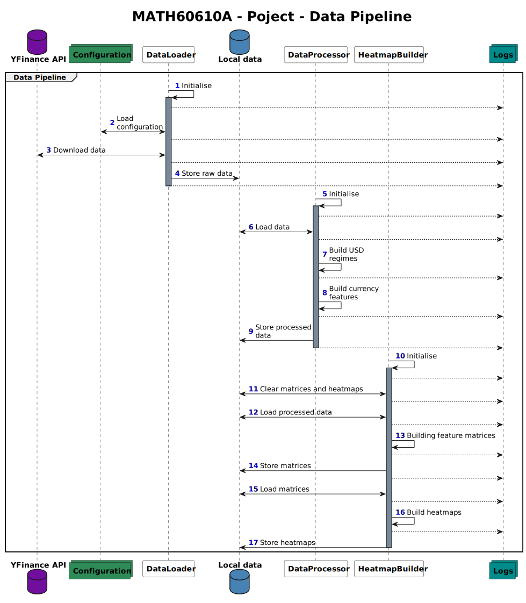
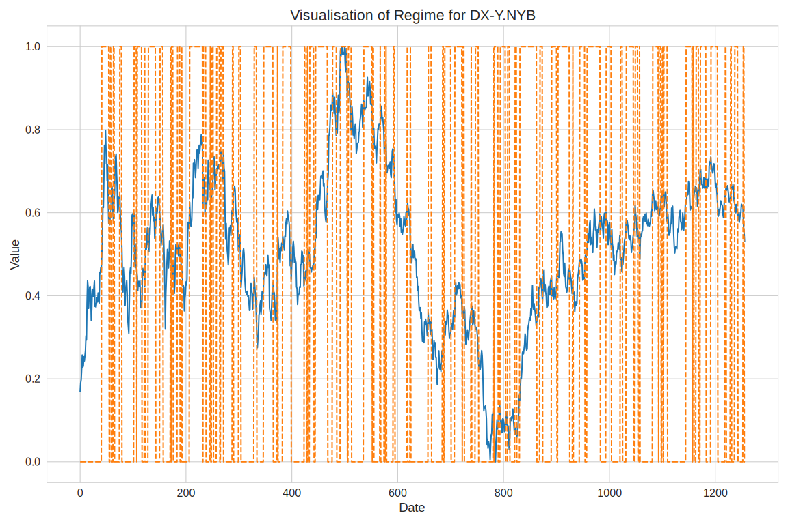
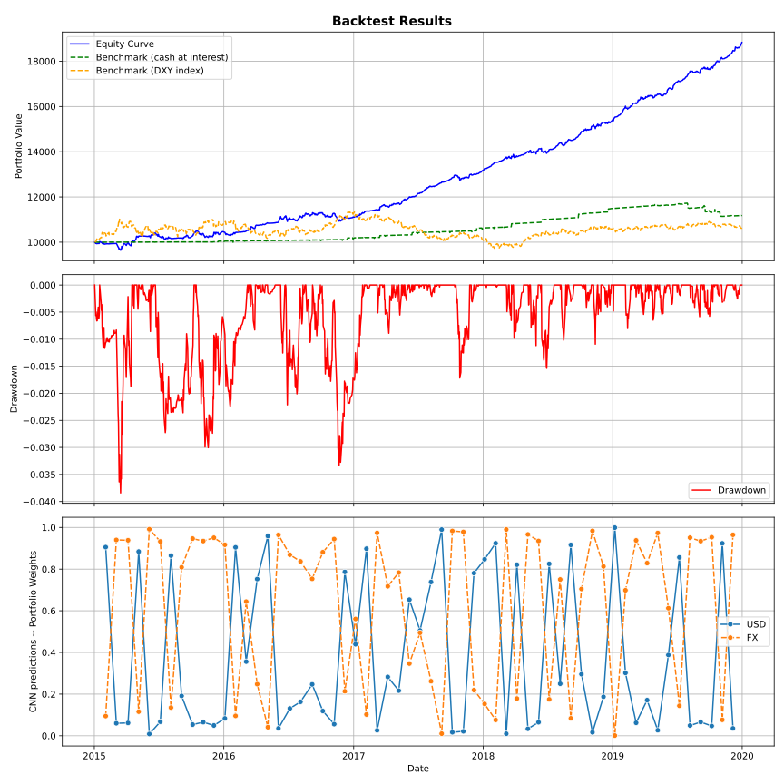

# FX heatmaps-based trading strategy

## Introduction
We aim to trade the different USD regimes (strong or weak) by leveraging
heatmaps to predict the different regimes. We build these heatmaps by constructing
a matrix of $K$ indicators by $N$ currency exchange rates. Then, using python's `seaborn`,
we transform the standardized matrix into a heatmap.

These heatmaps are then fed into a C-NN. After training, the C-NN is used to backtest the
strategy.

## Requirements
The following python packages are required:
```
yfinance
git+https://github.com/romainmrad/rotating_logger.git
pandas
numpy
ta
seaborn
matplotlib
tensorflow
```

## Strategy

### Sequence diagram


### USD Regimes
We aim to classify each time step as a certain USD regime. To do so, we analyse the `DXY` index and leverage SMA on log returns,
MACD and Aroon indicator.


### Heatmap for a timestep
We compute the same indicators for each currency exchange rate at each time step and render the heatmaps as follows:


## Backtest


We start with a hypothetical 10k$ investment and compare to two benchmarks:
- placing the 10k$ at the risk-free rate
- placing the 10k$ in the DXY index

The above graph is a backtest from 2015 to 2020 with monthly rebalance, achieving 3.15 Sharpe Ratio.
