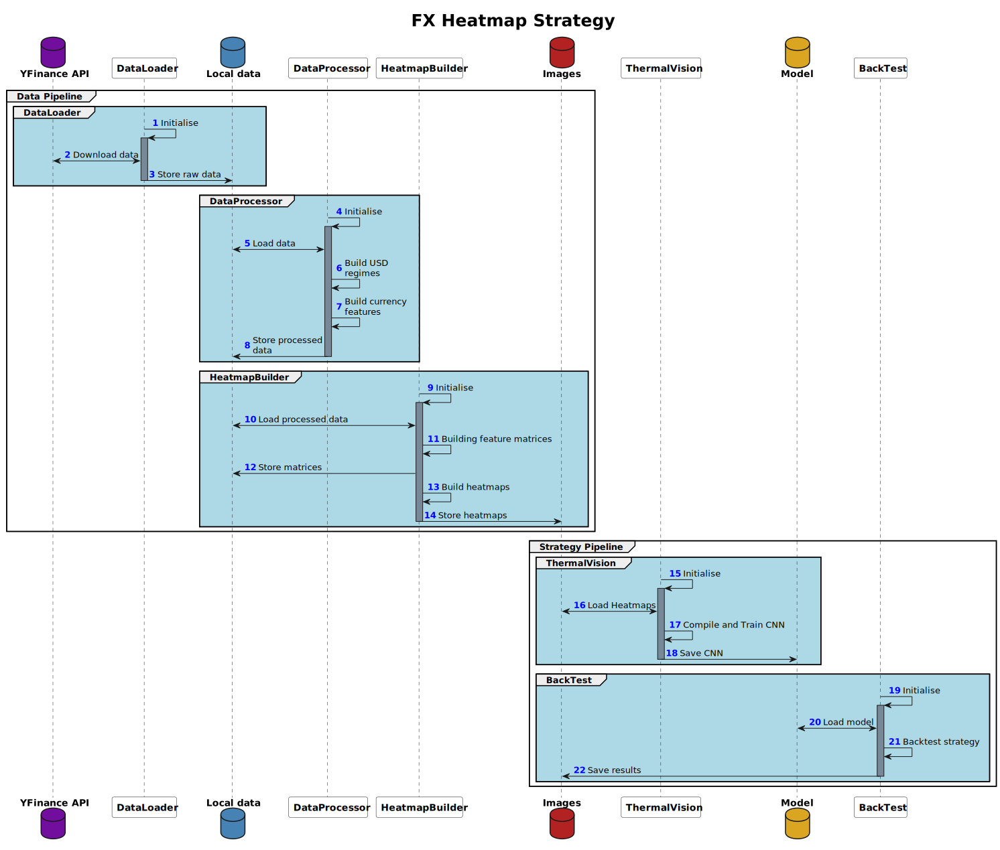

# FX heatmaps-based trading strategy

## Introduction
We aim to trade the different USD regimes (strong, neutral, weak) by leveraging
heatmaps to predict the different regimes. We build these heatmaps by constructing
a matrix of $K$ indicators by $N$ currency exchange rates. Then, using python's `seaborn`,
we transform the standardized matrix into a heatmap.

These heatmaps are then fed into a C-NN. After training, the C-NN is used to backtest the
strategy.

## Requirements
The following python packages are required:
```
yfinance
git+https://github.com/romainmrad/rotating_logger.git
pandas
numpy
ta
seaborn
matplotlib
```

## Data Pipeline

### Sequence diagram
The data pipeline is responsible for downloading the correct data, processing it and building
the heatmaps. Here is the sequence diagram:


### USD Regimes
We aim to classify each time step as a certain USD regime. To do so, we analyse the `DXY` index as
follows:
- Compute daily log-returns
- Compute log-returns rolling mean $\mu_{r_t}$ to smooth out signal
- Compute log-returns rolling standard deviation $\sigma_{r_t}$ to capture local volatility
- Compute smoothed-out log-returns mean $\mu_r$ and standard deviation $\sigma_r$

Then, we define returns and volatility threshold using two tuning parameters $\lambda_1$ and $\lambda_2$:
- Lower-bound returns: $\text{lb}=\mu_r - \lambda_1\sigma_r$
- Upper-bound returns: $\text{ub}=\mu_r + \lambda_1\sigma_r$
- Volatility threshold: $\text{sb}=\text{quantile}(\lambda_2)$

Finally, we follow these rules to classify the regime for a given time step $t$:
- If $\mu_{r_t}\geq \text{ub}$ and $\sigma_{r_t}\geq \text{sb}$, regime $R_t=2$ (high returns, high volatility)
- If $\mu_{r_t}\geq \text{ub}$ and $\sigma_{r_t}< \text{sb}$, regime $R_t=1$ (high returns, low volatility)
- If $\mu_{r_t}< \text{lb}$ and $\sigma_{r_t}\geq \text{sb}$, regime $R_t=-1$ (low returns, high volatility)
- If $\mu_{r_t}< \text{lb}$ and $\sigma_{r_t}< \text{sb}$, regime $R_t=-2$ (low returns, low volatility)
- Else, the regime is $R_t=0$

### Indicators
The following indicators are computed for each currency exchange rate:
- RSI momentum indicator
- MACD trend indicator
- Discrete rolling-window $W$ quadratic variation to capture physical variance:

$$\sum_{i\in W}{(r_{t_i}-r_{t_{i-1}})}^2$$

### Heatmap
The resulting indicator matrix is as follows:

| currency | RSI     | MACD     | quad_var |
|----------|---------|----------|----------|
| GBPUSD=X | -0.8545 | -0.38094 | -0.47701 |
| JPY=X    | -0.1715 | 2.751260 | 2.673975 |
| MXN=X    | 0.14175 | 0.375913 | 0.488822 |
| SGD=X    | 0.31143 | -0.39336 | -0.47666 |
| EURUSD=X | -1.1824 | -0.38565 | -0.47717 |
| CNY=X    | -1.7079 | -0.21310 | -0.47061 |
| AUDUSD=X | 0.87973 | -0.38400 | -0.47518 |
| INR=X    | 1.38486 | -0.57561 | 0.166257 |
| NZDUSD=X | 0.15337 | -0.37645 | -0.47502 |
| HKD=X    | 1.04530 | -0.41803 | -0.47736 |

We then use seaborn to transform it into a heatmap:


