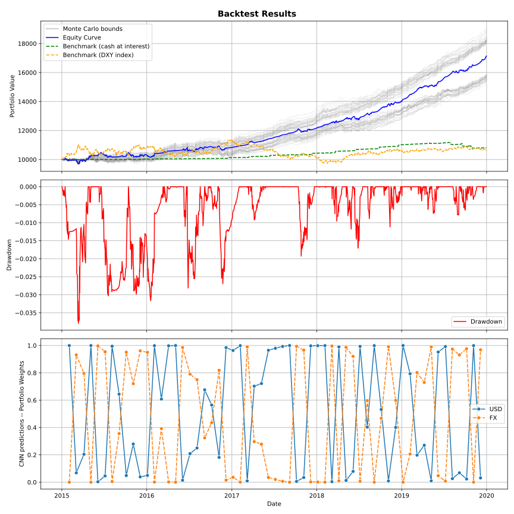

# FX heatmaps-based trading strategy

## Introduction
We aim to trade the different USD regimes (strong or weak) by leveraging
heatmaps to predict the different regimes. We build these heatmaps by constructing
a matrix of $K$ indicators by $N$ currency exchange rates. Then, using python's `seaborn`,
we transform the standardized matrix into a heatmap.

These heatmaps are then fed into a C-NN. After training, the C-NN is used to backtest the
strategy.

## Requirements
The following python packages are required:
```
rotating-logger @ git+https://github.com/romainmrad/rotating_logger.git@adfaec7ee5f6f3c2ce25c375f05ce044799208db
yfinance
tensorflow
pandas
numpy
ta
matplotlib
seaborn
scikit-learn
setuptools==68.2.2
```

## Strategy

### Sequence diagram


### USD Regimes
We aim to classify each time step as a certain USD regime. To do so, we analyse the `DXY` index and leverage SMA on log returns,
MACD and Aroon indicator.


### Heatmap for a timestep
We compute the same indicators for each currency exchange rate at each time step and render the heatmaps as follows:


## Backtest


We start with a hypothetical 10k$ investment and compare to two benchmarks:
- placing the 10k$ at the risk-free rate
- placing the 10k$ in the DXY index

Performance statistics are logged into the day's log file:
```
2025-10-07 09:46:54,280 - INFO     - --> Performance Summary:
2025-10-07 09:46:54,280 - INFO     - ------>   Total Return: 71.32%
2025-10-07 09:46:54,280 - INFO     - ------>   Annualized Return: 16.68%
2025-10-07 09:46:54,280 - INFO     - ------>   Annualized Volatility: 4.42%
2025-10-07 09:46:54,280 - INFO     - ------>   Sharpe Ratio: 3.262
2025-10-07 09:46:54,280 - INFO     - ------>   Sortino Ratio: 3.828
2025-10-07 09:46:54,280 - INFO     - ------>   Max Drawdown: -3.79%
2025-10-07 09:46:54,280 - INFO     - ------>   Calmar Ratio: 4.399
2025-10-07 09:46:54,281 - INFO     - ------>   Average Daily Return: 0.04%
2025-10-07 09:46:54,281 - INFO     - ------>   Daily Volatility: 0.23%
```
